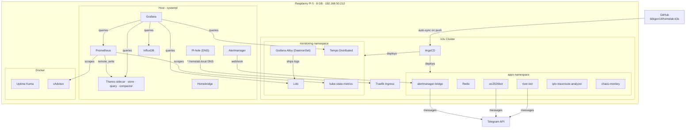

# homelab-k3s

Kubernetes manifests and Helm charts for my Raspberry Pi 5 homelab - a single-node [k3s](https://k3s.io/) cluster managed via [Helm](https://helm.sh/) and [ArgoCD](https://argo-cd.readthedocs.io/).

## Why

Started on Docker Compose and systemd (see [wc2026-telegram-bot](https://github.com/bibigon14/wc2026-telegram-bot), [alertmanager-telegram-bridge](https://github.com/bibigon14/alertmanager-telegram-bridge), [iptv-traceroute-analyzer](https://github.com/bibigon14/iptv-traceroute-analyzer)), then migrated everything to k3s and progressively added Helm packaging, GitOps-style delivery via ArgoCD, and Traefik-based ingress with local TLS for all homelab services.

This repo holds infrastructure manifests and Helm charts separately from application code - closer to how most teams split app repos from infra/GitOps repos in practice.

## Architecture




## Cluster

- Single-node k3s on a Raspberry Pi 5 8GB
- `local-path` is the default StorageClass (k3s built-in)
- Traefik ingress controller (k3s default) - used for all `*.homelab.local` services

## Namespaces

| Namespace | Purpose | Workloads |
|-----------|---------|-----------|
| `apps` | Application workloads | bridge, redis, wc2026bot, iptv-bot, iptv-*, sre-analytics, chaos-monkey |
| `monitoring` | Observability stack | loki, alloy, kube-state-metrics, tempo-*, external-services + IngressRoutes |
| `argocd` | GitOps controller | ArgoCD + argocd.homelab.local IngressRoute |
| `external-secrets` | Secret management | External Secrets Operator |
| `secrets` | ESO secret source | iptv-secrets (source for ESO ClusterSecretStore) |
| `kube-system` | k3s system | Traefik, CoreDNS, metrics-server |

## Structure

```
namespaces/
  apps.yaml                           # apps namespace
  monitoring.yaml                     # monitoring namespace
charts/
  alertmanager-telegram-bridge/       # Helm chart: Deployment + NodePort Service + Secret
  redis/                              # Helm chart: Deployment + PVC + ClusterIP Service
  wc2026bot/                          # Helm chart: Deployment + Secret
  iptv-traceroute-analyzer/           # Helm chart: Deployment + 3 CronJobs + ExternalSecret
  kube-state-metrics/                 # Helm chart: ClusterRole/ClusterRoleBinding + Deployment + NodePort Service
  loki/                               # Helm chart: single-binary Loki, Deployment + PVC + Service
  alloy/                              # Helm chart: Grafana Alloy DaemonSet + RBAC (log shipper)
  sre-analytics/                      # Helm chart: CronJob (Cloudflare + Telegram analytics)
  chaos-monkey/                       # Helm chart: CronJob + RBAC (random pod killer)
  external-services/                  # Helm chart: Services + EndpointSlices + IngressRoutes for host services
argocd/
  argocd-cm.yaml                      # ArgoCD ConfigMap (resource exclusions, customizations)
  bridge-app.yaml                     # ArgoCD Application → apps
  redis-app.yaml                      # ArgoCD Application → apps
  wc2026bot-app.yaml                  # ArgoCD Application → apps
  iptv-app.yaml                       # ArgoCD Application → apps
  sre-analytics-app.yaml              # ArgoCD Application → apps
  chaos-monkey-app.yaml               # ArgoCD Application → apps
  kube-state-metrics-app.yaml         # ArgoCD Application → monitoring
  loki-app.yaml                       # ArgoCD Application → monitoring
  alloy-app.yaml                      # ArgoCD Application → monitoring
  tempo-app.yaml                      # ArgoCD Application → monitoring (upstream grafana/tempo-distributed)
  external-services-app.yaml          # ArgoCD Application → monitoring
  argocd-ingress-app.yaml             # ArgoCD Application → argocd
ingress/
  argocd-ingress.yaml                 # IngressRoute: argocd.homelab.local
certs/
  ca.crt                              # Homelab CA certificate (add to System Keychain for trusted TLS)
  homelab.local.crt                   # Wildcard cert for *.homelab.local (397 days, Apple-compliant)
  renew-cert.sh                       # Script to renew TLS cert and update cluster secrets
```

## Apps

### apps namespace

#### redis

Shared cache and state store used by `wc2026bot` and `iptv-notify`/`iptv-auto-switch` (alert dedup, current-server state). Persists to a 1Gi PVC. Exposed as `redis:6379` within the `apps` namespace.

#### wc2026bot

[World Cup 2026 Telegram bot](https://github.com/bibigon14/wc2026-telegram-bot) - Redis-cached API calls, per-user rate limiting. `access.log` persisted to a 64Mi PVC via `subPath` mount (initContainer ensures the file exists before the main container starts).

> If `local-path`'s PVC is ever recreated (helm uninstall/install, PV reclaim), the backing directory under `/var/lib/rancher/k3s/storage/` gets a new name (it's keyed by PV UID), silently breaking any symlink pointing at the old path. See `relink-logs.sh` in the [wc2026-telegram-bot](https://github.com/bibigon14/wc2026-telegram-bot) repo for a script that re-detects the current path via `kubectl` and fixes the symlink.

#### bridge (alertmanager-telegram-bridge)

[Prometheus Alertmanager → Telegram forwarder](https://github.com/bibigon14/alertmanager-telegram-bridge). Exposed via `NodePort 30119` so the host's systemd-managed Alertmanager can reach it at `http://localhost:30119/webhook`. Config (token, chat ID, routing rules, quiet hours) mounted from a Secret as `/config/config.yaml`.

#### iptv (iptv-traceroute-analyzer)

[IPTV server health monitor](https://github.com/bibigon14/iptv-traceroute-analyzer) - Deployment + three CronJobs:

- `iptv-bot` - Telegram bot for IPTV status queries
- `iptv-influx-writer` - every 30 min, `mtr`-based checks against 8 servers, writes to InfluxDB
- `iptv-notify` - at :15 and :45, 7am-11pm Pacific, Telegram alerts on degradation (dedup via Redis)
- `iptv-auto-switch` - hourly, switches active IPTV server based on hysteresis logic

All jobs require `NET_RAW`/`NET_ADMIN` capabilities for `mtr`. Secrets managed via ESO (`ExternalSecret` → `ClusterSecretStore: kubernetes-secrets` → `secrets/iptv-secrets`).

> InfluxDB and Alertmanager run on the host via systemd. CronJobs reach them via `192.168.50.212`.

#### sre-analytics

CronJob running daily at 8am Pacific - collects Cloudflare analytics (zone stats, KV metrics) and posts a summary to Telegram. Secrets in `sre-analytics-env`.

#### chaos-monkey

CronJob running hourly - picks a random running pod outside system namespaces and deletes it. Tests workload resilience. Has its own `ServiceAccount` + `ClusterRole` with pod delete permissions only.

### monitoring namespace

#### kube-state-metrics

Kubernetes object-state exporter - Prometheus metrics for Pod/Deployment/Job/CronJob/PVC status. Backed by a ClusterRole with read-only access. Exposed via `NodePort 30809` for host-based Prometheus scraping.

#### loki + alloy

Centralized log aggregation: [Loki](https://grafana.com/oss/loki/) (single-binary mode, 10Gi PVC, 7-day retention, filesystem storage backend) paired with [Grafana Alloy](https://grafana.com/docs/alloy/) as the log shipper, deployed as a DaemonSet.

Alloy discovers pods via the Kubernetes API, collects logs from `apps`, `monitoring`, and `homelab` namespaces, and ships to Loki. Requires `runAsUser: 0` since `/var/log/pods` is root-owned. Exposed via `NodePort 30811` for Grafana data source.

#### tempo

[Tempo](https://grafana.com/oss/tempo/) distributed tracing - deployed via upstream `grafana/tempo-distributed` chart (v1.61.3, single-replica mode). Components: distributor, ingester, querier, query-frontend, compactor, memcached. Accepts OTLP traces via gRPC (4317) and HTTP (4318). Local filesystem storage.

#### external-services

Services + EndpointSlices + IngressRoutes for host-based services (Prometheus, Grafana, InfluxDB, etc.). All pointing to `192.168.50.212`. Managed by ArgoCD - EndpointSlices are tracked since `discovery.k8s.io/EndpointSlice` was removed from ArgoCD resource exclusions in `argocd-cm.yaml`.

## ArgoCD

ArgoCD watches this repo and syncs all apps automatically on push to `main`.

**UI:** `https://argocd.homelab.local`

### Apply all ArgoCD Applications

```bash
kubectl apply -f argocd/
```

### Check sync status

```bash
kubectl get applications -n argocd
```

### ArgoCD ConfigMap

`argocd/argocd-cm.yaml` is tracked in git and applied via `kubectl apply -f argocd/argocd-cm.yaml`. Key customization: `EndpointSlice` removed from `resource.exclusions` so ArgoCD can create and manage EndpointSlices for the external-services chart.

### Secrets management

Secrets are managed outside ArgoCD to avoid selfHeal race conditions:

- `bridge-config`, `wc2026bot-env`, `sre-analytics-env` - created imperatively via `kubectl create secret`
- `iptv-env` - managed by External Secrets Operator (ESO), sourced from `secrets/iptv-secrets`

All ArgoCD Application manifests use `ignoreDifferences` on Secret `/data` to prevent overwriting live secrets on sync.

### selfHeal and secrets - lessons learned

`syncPolicy.automated.selfHeal: true` makes ArgoCD continuously reconcile live state back to git. Since sensitive values aren't in git, ArgoCD's Helm render has no secret values - with `selfHeal: true` it will periodically overwrite live Secrets with empty values.

**Fix applied:** secrets are created imperatively outside ArgoCD. ArgoCD Applications use `ignoreDifferences` on Secret `/data`. ESO-managed secrets (`iptv-env`) are owned by the ExternalSecret resource, not ArgoCD directly.

### Get admin password

```bash
kubectl -n argocd get secret argocd-initial-admin-secret \
  -o jsonpath="{.data.password}" | base64 -d && echo
```

### Expose ArgoCD metrics for Prometheus (one-time setup)

```bash
kubectl patch svc argocd-metrics -n argocd \
  -p '{"spec": {"type": "NodePort", "ports": [{"port": 8082, "targetPort": 8082, "nodePort": 30810, "name": "metrics"}]}}'
```

## Traefik Ingress

All homelab services are exposed via Traefik with a wildcard TLS certificate for `*.homelab.local`. IngressRoutes live in the `monitoring` namespace (external-services chart) and `argocd` namespace.

### Services

| URL | Service | Namespace |
|-----|---------|-----------|
| `https://argocd.homelab.local` | ArgoCD | argocd |
| `https://grafana.homelab.local` | Grafana (host systemd) | monitoring |
| `https://uptime.homelab.local` | Uptime Kuma (Docker) | monitoring |
| `https://homebridge.homelab.local` | Homebridge (host systemd) | monitoring |
| `https://influxdb.homelab.local` | InfluxDB (host systemd) | monitoring |
| `https://pihole.homelab.local` | Pi-hole (host systemd) | monitoring |
| `https://cadvisor.homelab.local` | cAdvisor (Docker) | monitoring |
| `https://thanos.homelab.local` | Thanos Query (host systemd) | monitoring |
| `https://alertmanager.homelab.local` | Alertmanager (host systemd) | monitoring |
| `https://prometheus.homelab.local` | Prometheus (host systemd) | monitoring |

> Pi-hole web interface runs on port 8090 (moved from 80 to avoid conflict with Traefik).

### NodePort services (not behind Traefik)

| Port | Service | Namespace | Purpose |
|------|---------|-----------|---------|
| `30119` | bridge | apps | Alertmanager webhook target |
| `30808` | argocd-server | argocd | HTTPS UI/API |
| `30809` | kube-state-metrics | monitoring | Prometheus scrape target |
| `30810` | argocd-metrics | argocd | Prometheus scrape target |
| `30811` | loki | monitoring | Grafana data source |

### TLS setup

A local CA (`certs/ca.crt`) signs a wildcard certificate for `*.homelab.local` (397 days - Apple's maximum for trusted TLS since 2020).

To trust on macOS:
1. Copy `certs/ca.crt` to your Mac
2. Double-click → Keychain Access → add to **System** keychain
3. Find **Homelab CA** → Get Info → Trust → **Always Trust**

To renew (run ~11 months after last issuance):
```bash
cd certs/
./renew-cert.sh
```

The script reissues the cert and updates `homelab-tls` secrets in `default`, `monitoring`, and `argocd` namespaces, then restarts Traefik.

### DNS setup (Pi-hole)

```bash
sudo pihole-FTL --config dns.hosts '[
  "192.168.50.1 router.asus.com",
  "192.168.50.212 argocd.homelab.local",
  "192.168.50.212 grafana.homelab.local",
  "192.168.50.212 uptime.homelab.local",
  "192.168.50.212 homebridge.homelab.local",
  "192.168.50.212 influxdb.homelab.local",
  "192.168.50.212 pihole.homelab.local",
  "192.168.50.212 cadvisor.homelab.local",
  "192.168.50.212 thanos.homelab.local",
  "192.168.50.212 alertmanager.homelab.local",
  "192.168.50.212 prometheus.homelab.local"
]'
sudo systemctl restart pihole-FTL
```

## Update workflow

After a code change in an app repo:

```bash
docker build -t <image>:latest .
docker save <image>:latest | sudo k3s ctr images import -
kubectl rollout restart deployment/<name> -n apps
# CronJobs pick up the new image on their next scheduled run
```

To update chart configuration (non-secret values):

```bash
# Edit charts/<chart>/values.yaml, then:
git add charts/<chart>/values.yaml
git commit -m "chore: update <chart> values"
git push
# ArgoCD syncs automatically within ~3 minutes
```

> Note: editing a ConfigMap (e.g. `alloy/templates/configmap.yaml`) via git push does **not** restart pods that mount it. After a ConfigMap-only change, restart the workload manually:
> ```bash
> kubectl rollout restart daemonset/alloy -n monitoring
> ```

## Status

```bash
kubectl get pods -n apps
kubectl get pods -n monitoring
kubectl get applications -n argocd
kubectl get ingressroute -n monitoring
kubectl get ingressroute -n argocd
helm list -n monitoring
```

## License

MIT

## Grafana

Datasources provisioned via `/etc/grafana/provisioning/datasources/homelab.yaml`.

Template stored in `grafana/datasources.yaml`. On fresh install:

```bash
sudo mkdir -p /etc/grafana/provisioning/datasources
sudo cp grafana/datasources.yaml /etc/grafana/provisioning/datasources/homelab.yaml
# Replace REPLACE_WITH_INFLUXDB_TOKEN with actual token from InfluxDB UI → Load Data → API Tokens
sudo nano /etc/grafana/provisioning/datasources/homelab.yaml
sudo systemctl restart grafana-server
```
